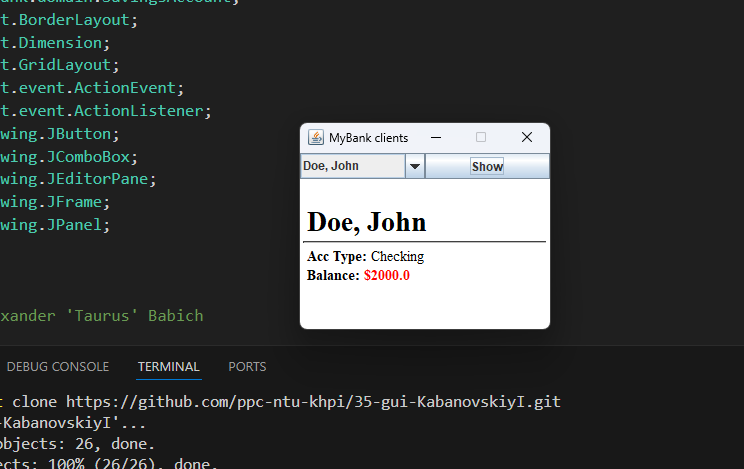
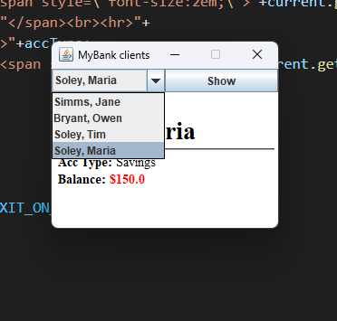
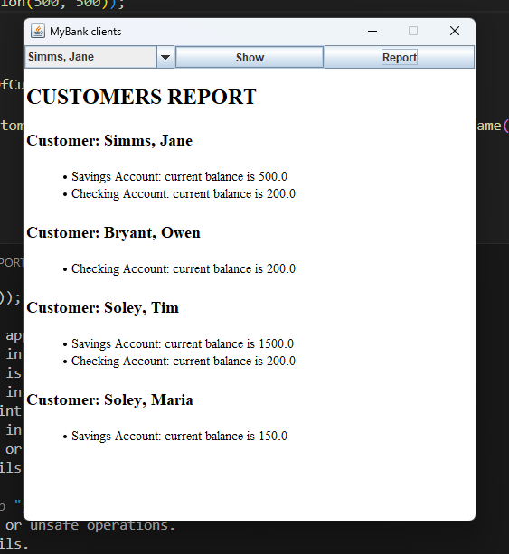

# UI Lab 3
## Підключення MyBank

## Підключення test.dat

## Додавання Report
<b>Для більш красивішого вигляду, був створений клас CustomerReportHtml, який перетворює дані в html код, та повертає його як string</b>
